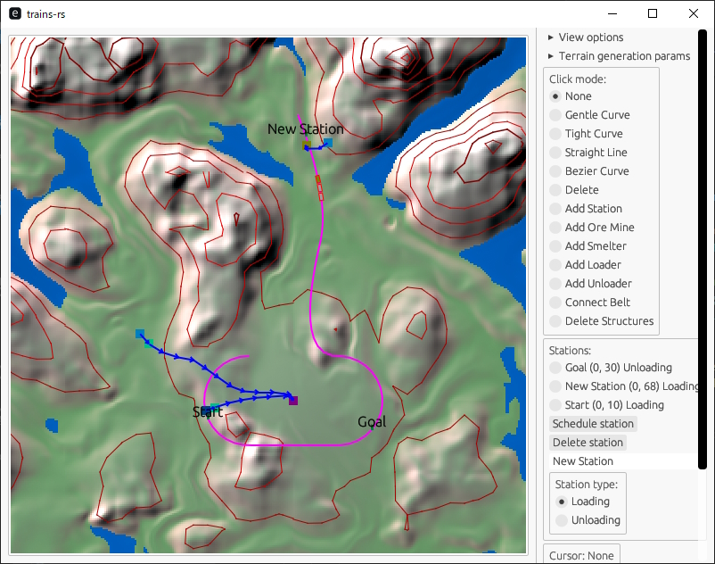

# trains-rs

A train logistics simulator with terrain in Rust



## How to run

Install Rust.

Run `cargo r`

## Terrain generation and noise expression

We use a concept called noise expression to generate terrain procedurally.
A noise expression is kind of a mini-programming language that has very limited features but designed to be concise
to describe a noise function.
It is an idea stolen from Factorio.

Notable features:

* It allows very highly customizable terrain generation logic with quick test iterations,
  since you do not need to recompile the executable to try new logic.
* Some expensive functions are provided as built-in functions, so that the scripting interpreter does not need to run
  them in the inefficient scripting runtime.

An example of a noise expression is like below.

```
octaves = 4;
abs_rounding = 0.1;
pers = perlin_noise(x, 3, 0.5);

softmax(
  softabs(
    perlin_noise(x, octaves, pers),
    abs_rounding
  ),
  0.1 - softclamp(
    softabs(
      perlin_noise(x * 0.5, octaves, pers),
      abs_rounding
    ),
    abs_rounding
  )
)
```

It is called noise _expression_, but it can have variables and constants defined in statements.

Since it is a programming language, we describe its specification here.

### Data types

This language has 2 types:

* `Scalar` - a f64 value.
* `Vec2` - a vector of f64 with 2 elements. used to pass a position in the terrain.

The language is dynamically typed, it does not check type correctness until runtime.

### Variable definition statements

An assignment to an identifier followed by a semicolon is a variable definition statement.

```
a = 1;
```

It can have expression on right hand side.
You can use other variables that were defined up to this point.

```
a = 1;
b = a * 2;
```

### Expressions

An expression can contain arithmetics (`+`, `-`, `*` and `/`), parentheses and function calls.
For example, the string below is an expression.

```
((a + 1) * b) - f(2)
```

Any expression that does not depend on the value of `x` is a constant expression.
The distinction of constant expression is important for `perlin_noise` and `white_noise`
functions.

### Built-in functions

You cannot define your own functions (therefore, this language is not Turing complete).
You can use one of the following built-in functions.

* `vec2(x, y)` - a constructor for `Vec2` type. `x` and `y` must be scalars.
* `x(x)` - a getter function to extract `x` component of a vector. Errors when applied to a scalar.
* `y(x)` - a getter function, similar to `x()`, but for `y` component.
* `softclamp(x, max)` - a function that behaves like identity function in small `x`,  but converges asymptotically to `max` in a great `x`. You can use this function to limit a certain value, but with smooth saturation curve instead of sudden step.
* `softabs(x, rounding)` - a function that acts like the `abs` function in a great `x`, but acts like a quadratic function in a smaller `x` than `rounding`.
* `softmax(a, b)` - a function that acts like `max` if either `a` or `b` is much greater than the other, but behaves like an average when their values are similar.
* `perlin_noise(x, octaves, persistence)` - A [Perlin noise](https://en.wikipedia.org/wiki/Perlin_noise) with [fractal Brownian motion](https://en.wikipedia.org/wiki/Fractional_Brownian_motion) compositions. It is relatively expensive operation, so the composition of multiple octaves are implemented in the runtime. `x` is the input value of type `Vec2`, `octaves` is the number of octaves to add in fBm noise whose fractional part is truncated and casted to an integer, and `persistence` is the factor multiplied to each successive octave. One notable thing about this function is that `octaves` has to be a constant expression, because it caches the state variables to generate many values from different `x`.
* `white_noise(x, octaves, persistence)` - A noise function similar to `perlin_noise`, but uses uniform noise as the base noise instead of Perlin noise. It can still show locality and natural looking features if you use many octaves.
